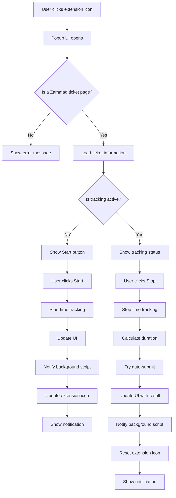
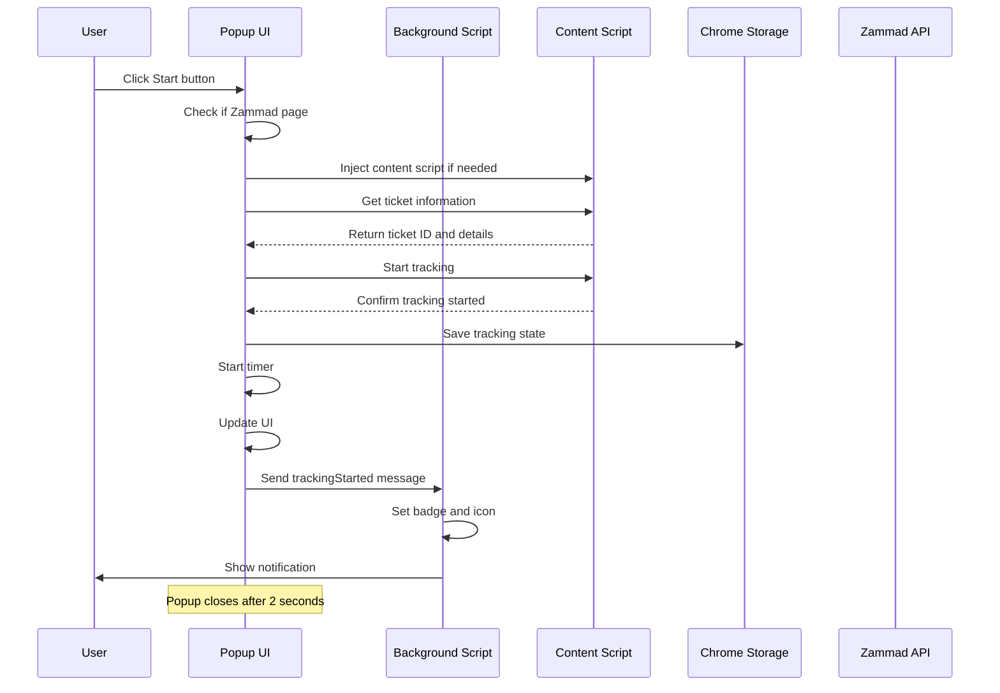
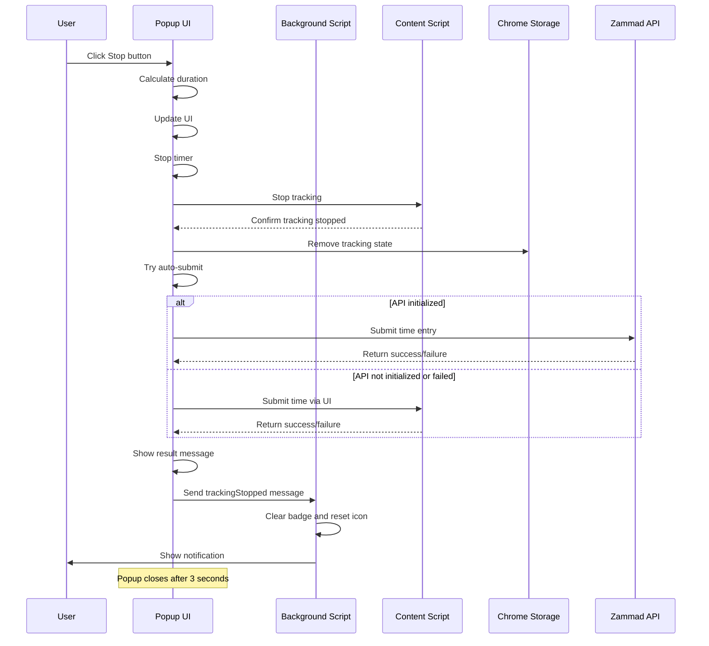
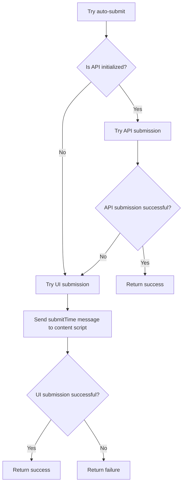
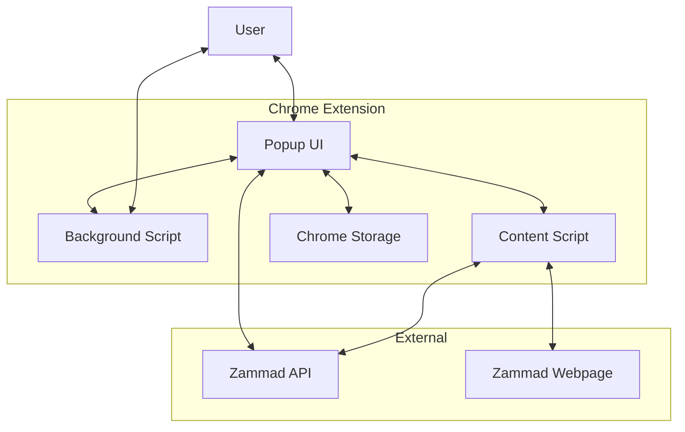

# Zammad Timetracking Extension - Flow Chart

This document provides a visual representation of the data flow and component interactions in the Zammad Timetracking Extension.

## Component Overview

The extension consists of the following main components:

1. **Popup UI** (popup.js, popup.html) - The user interface that appears when clicking the extension icon
2. **Background Script** (background.js) - Manages the extension's state and handles notifications
3. **Content Script** (content.js) - Interacts with the Zammad webpage
4. **API Service** (api.js) - Communicates with the Zammad API
5. **Storage** - Chrome's local storage for persisting state

## Flow Charts

### Main Process Flow

### Time Tracking Start Process

### Time Tracking Stop Process

### Auto-Submit Process

### Component Interaction Diagram

## Data Flow

### Storage Data

The extension uses Chrome's local storage to persist the following data:

1. **zammadTrackingState** - Information about the current tracking session:
   - isTracking: boolean
   - startTime: ISO date string
   - ticketId: string
   - title: string
   - timeSpent: number (minutes)
   - url: string

2. **zammadSettings** - User preferences:
   - notifications: boolean
   - autoSubmit: boolean
   - language: string ('de' or 'en')

3. **zammadApiSettings** - API configuration:
   - baseUrl: string
   - token: string

### Message Types

The extension uses message passing for communication between components:

1. **From Popup to Background:**
   - trackingStarted: {ticketId, startTime}
   - trackingStopped: {ticketId, title, duration, success}

2. **From Popup to Content:**
   - getTicketInfo: {}
   - startTracking: {}
   - stopTracking: {}
   - submitTime: {duration, ticketId}

3. **From Content to Background:**
   - trackingStarted: {ticketId}
   - trackingStopped: {ticketId, duration, success}

## Legend

- **Rectangles**: Actions or states
- **Diamonds**: Decision points
- **Arrows**: Flow direction
- **Participants**: Components in sequence diagrams
- **Notes**: Additional information